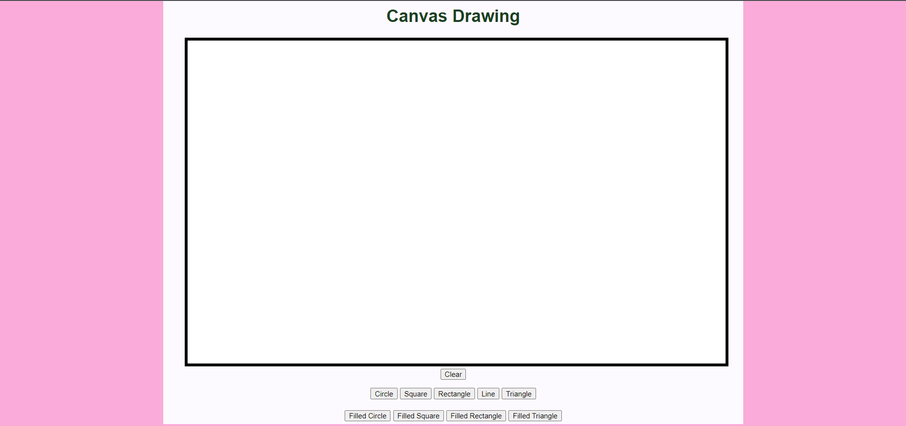
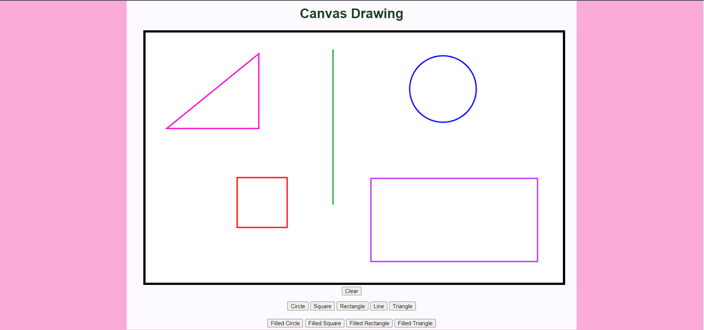
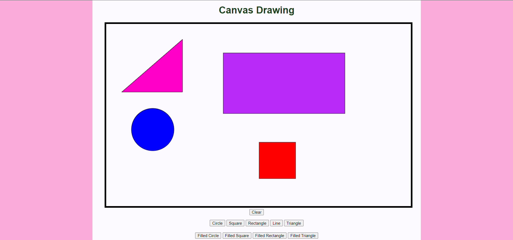
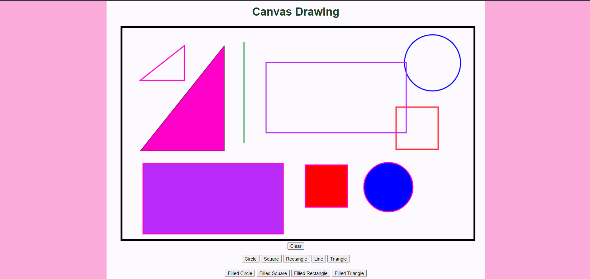
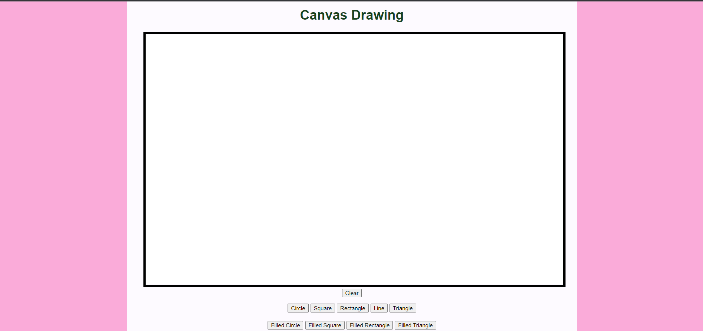

# Web Page for Paint Application

## AIM:

To design a static website for Paint Application using HTML5 canvas.

## DESIGN STEPS:

### Step 1:

Requirement collection.

### Step 2:

Creating the layout using HTML,CSS and canvas.

### Step 3:

Write javascript to capture move events.

### Step 4:

Perform the drawing operation based on the user input.

### Step 5:

Validate the layout in various browsers.

### Step 6:

Validate the HTML code.

### Step 6:

Publish the website in the given URL.

## PROGRAM :

```

<!DOCTYPE html>
<html lang="en">
  <head>
    <meta charset="UTF-8" />
    <meta http-equiv="X-UA-Compatible" content="IE=edge" />
    <meta name="viewport" content="width=device-width, initial-scale=1.0" />
    <title>Paint Application</title>
    <style>
      * {
        box-sizing: border-box;
        font-family: Arial, Helvetica, sans-serif;
      }
      body {
        background-color: #faabd9;
        color: #17421d;
      }
      .container {
        width: 1080px;
        margin-left: auto;
        margin-right: auto;
      }
      .content {
        display: block;
        width: 100%;
        background-color:rgb(253, 250, 255);
        min-height: 800px;
        margin: 100px 50px 0px 0px;
        padding-top: 20px;
      }
      h1 {
        text-align: center;
      }
      canvas {
        margin-left: 40px;
        margin-right: 40px;
      }
      .toolbar {
        text-align: center;
        font-size: 16px;
      }
     #button{
       text-align: center;
     }
       .but{
            padding-top: 15px;
            padding-bottom:5px ;
       } 
       .but1{
            padding-top: 15px;
            padding-bottom:5px ;
       } 
        
        
      
    </style>
            <script type="text/javascript">
              function myClickevent(e){
                  var message;
               ctx.beginPath();
               if (shape==0){
               ctx.arc(e.offsetX,e.offsetY, 80, 0, 2 * Math.PI);
                ctx.strokeStyle ="#0000FF";
                ctx.lineWidth = 3;
                          }else if (shape==1){
                    ctx.rect(e.offsetX,e.offsetY, 120,120);
                    ctx.strokeStyle ="#FF0000";
                    ctx.lineWidth = 3;
                  }else if (shape==2){
                    ctx.rect(e.offsetX,e.offsetY, 400,200);
                    ctx.strokeStyle = "#B929F7";
                    ctx.lineWidth = 3;
                              }else if (shape==3){
                ctx.moveTo(e.offsetX,e.offsetY);
                ctx.lineTo(e.offsetX,40);
                
                ctx.fill();
                ctx.strokeStyle = "#239F31";
                ctx.lineWidth = 3;    
                }    else if (shape==4){
                  
                  
                ctx.moveTo(e.offsetX,e.offsetY);
                ctx.lineTo(e.offsetX,50);
                ctx.lineTo(50,e.offsetY);
                ctx.closePath();
                //ctx.lineTo(e.offsetX,e.offsetY);
                //ctx.lineTo(e.offsetX,e.offsetX);
                ctx.strokeStyle = "#FF00C8";
                ctx.lineWidth = 3;
                }       else if (shape==5){
                  ctx.fillStyle ="white";
                      ctx.fillRect(0,0,1000,600);
                    
                   
                  } else if (shape==6){
               ctx.arc(e.offsetX,e.offsetY, 70, 0, 2 * Math.PI);
               ctx.fillStyle ="#0000FF";
               ctx.fill()
               
              }
              else if (shape==7){
                    ctx.rect(e.offsetX,e.offsetY, 120,120);
                    ctx.fillStyle ="#FF0000";
                    ctx.fill()
                  }else if (shape==8){
                    ctx.rect(e.offsetX,e.offsetY, 400,200);
                    ctx.fillStyle ="#B929F7";
                    ctx.fill()
                  }else if (shape==9){
                  ctx.moveTo(e.offsetX,e.offsetY);
                  ctx.lineTo(e.offsetX,50);
                  ctx.lineTo(50,e.offsetY);
                  ctx.closePath();
                  ctx.fillStyle ="#FF00C8";
                    ctx.fill()
                  }

       

    
    
    ctx.stroke();
              }
              function circleclicked(){
                shape=0;
              }
              function squareclicked(){
                  shape=1;
                }
                function rectangleclicked(){
                  shape=2;
                }
                function lineclicked(){
                  shape=3;
                }
                function triangleclicked(){
                  shape=4;
                }
                function clearclicked(){
                  shape=5;
                }
                function fCclicked(){
                  shape=6;
                }
                function fSclicked(){
                  shape=7;
                }
                function fRclicked(){
                  shape=8;
                }
                function fTclicked(){
                  shape=9;
                }


      </script>
        </head>
        <body>
            <div class="container">
                <div class="content">

            <h1>Canvas Drawing </h1>
            
            <canvas id="myCanvas"  width="1000" height="600" style="border:6px solid #000000;"></canvas>
             
            
            <div class="toolbar">
            <div>
              <input type="button" id="clear" value="Clear"/>
            </div>
              <div class="but">
                <input type="button" id="circle" value="Circle"/>
                <input type="button" id="square" value="Square"/>
                <input type="button" id="rectangle" value="Rectangle"/>
                <input type="button" id="line" value="Line"/>
                <input type="button" id="triangle" value="Triangle"/>
             </div>
             <div class="but1">
                <input type="button" id="fC" value="Filled Circle"/>
                <input type="button" id="fS" value="Filled Square"/>
                <input type="button" id="fR" value="Filled Rectangle"/>
                <input type="button" id="fT" value="Filled Triangle"/>
               </div>
                
                
            </div>
            </div>
            </div>
            <script>
              var c = document.getElementById("myCanvas");
    var ctx = c.getContext("2d");
    shape=0;
    ctx.beginPath();
    ctx.stroke();

    c.addEventListener("click",myClickevent);
    document
    .getElementById("circle")
    .addEventListener("click",circleclicked);
    document
    .getElementById("square")
    .addEventListener("click",squareclicked);
    document
    .getElementById("rectangle")
    .addEventListener("click",rectangleclicked);
    document
    .getElementById("line")
    .addEventListener("click",lineclicked);
    document
    .getElementById("triangle")
    .addEventListener("click",triangleclicked);
    document
    .getElementById("clear")
    .addEventListener("click",clearclicked);
    document
    .getElementById("fC")
    .addEventListener("click",fCclicked);
    document
    .getElementById("fS")
    .addEventListener("click",fSclicked);
    document
    .getElementById("fR")
    .addEventListener("click",fRclicked);
    document
    .getElementById("fT")
    .addEventListener("click",fTclicked);


            </script>
            
  
  </body>
</html>
```

## OUTPUT:
## CANVAS:

## WITH SHAPE:





## WHEN USED CLEAR:



## Result:

Thus a website is designed and validated for paint application using HTML5 canvas.
